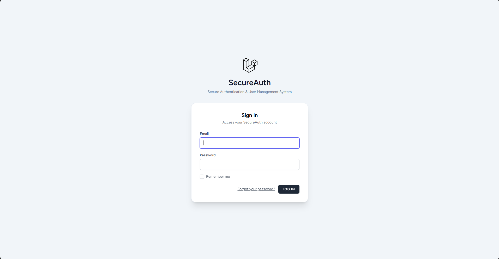
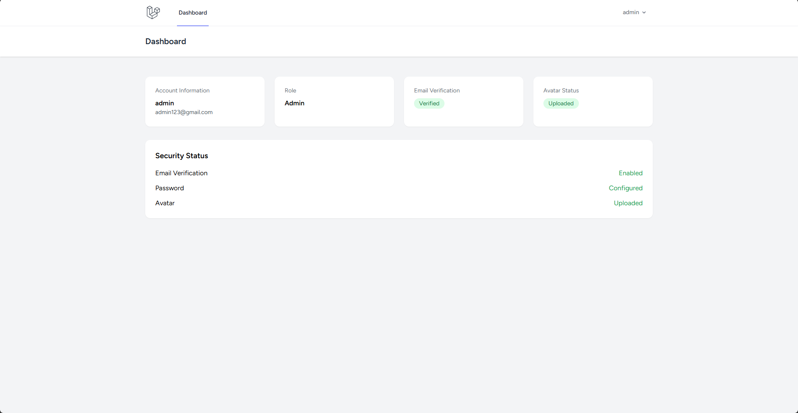
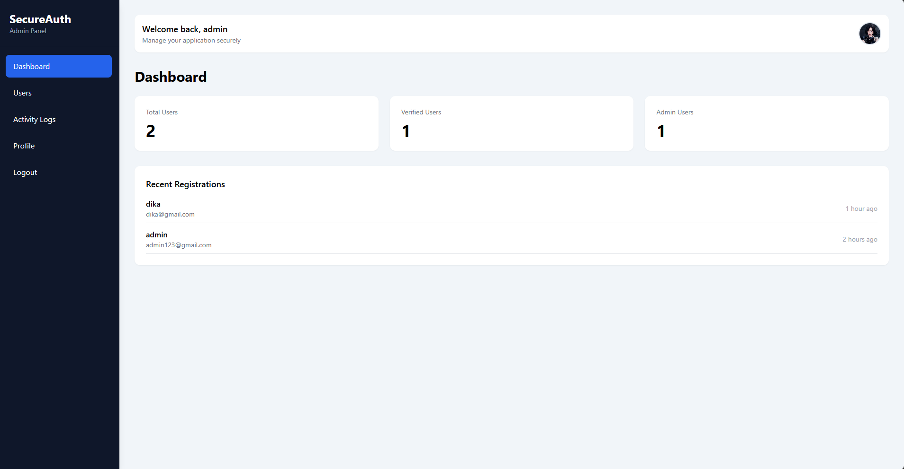
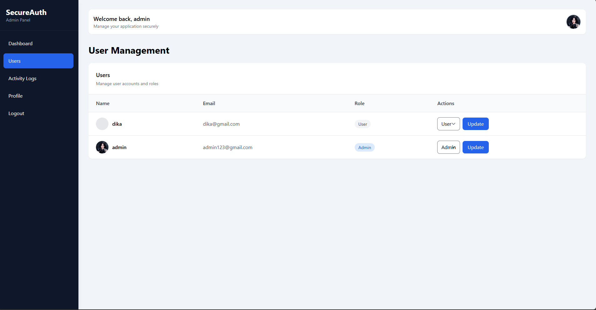
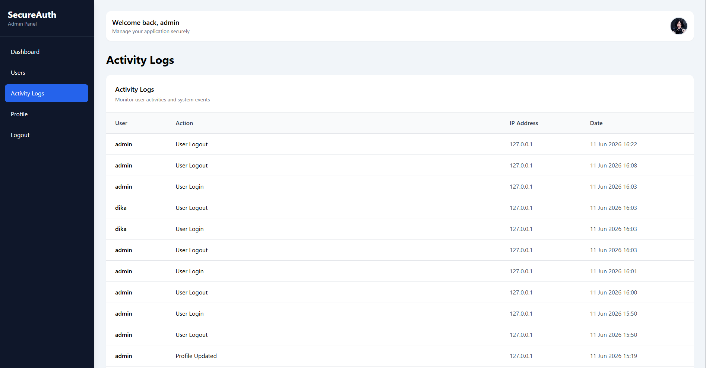

# SecureAuth

A secure authentication and user management system built with Laravel 12.

## Highlights

- Authentication & Authorization
- Email Verification
- Role-Based Access Control
- Admin Dashboard
- Activity Logging
- Profile & Avatar Management
- Automated Testing

---

## Features

### Authentication

* User Registration
* User Login & Logout
* Remember Me Functionality
* Forgot Password
* Password Reset
* Email Verification

### Authorization

* User Role Management
* Admin Middleware Protection
* Admin Dashboard Access Control
* Role-Based Access Control (RBAC)

### Profile Management

* Update Profile Information
* Change Password
* Upload Profile Avatar
* Replace Existing Avatar
* Email Update Support

### Admin Features

* Admin Dashboard
* User Management
* Change User Roles
* Activity Log Monitoring
* Dashboard Statistics

### Activity Logging

Tracks important user actions:

* Registration
* Login
* Logout
* Profile Updates
* Password Changes
* Role Changes

### Security Features

* Password Hashing
* CSRF Protection
* Email Verification
* Route Middleware Protection
* Login Rate Limiting

### Testing

Feature tests included for:

* Authentication
* Authorization
* User Roles
* Password Management
* Profile Management
* Email Verification

---

## Tech Stack

| Technology     | Purpose                    |
| -------------- | -------------------------- |
| Laravel 12     | Backend Framework          |
| PHP 8.3+       | Server-side Language       |
| MySQL          | Database                   |
| Tailwind CSS   | UI Styling                 |
| Laravel Breeze | Authentication Starter Kit |
| PHPUnit        | Testing                    |
| Git & GitHub   | Version Control            |

---

## Database Structure

### users

| Column            | Type      |
| ----------------- | --------- |
| id                | bigint    |
| name              | string    |
| email             | string    |
| password          | string    |
| avatar            | string    |
| role              | enum      |
| email_verified_at | timestamp |
| created_at        | timestamp |
| updated_at        | timestamp |

### activity_logs

| Column     | Type      |
| ---------- | --------- |
| id         | bigint    |
| user_id    | bigint    |
| action     | string    |
| ip_address | string    |
| created_at | timestamp |

---

## Installation

Clone the repository:

```bash
git clone https://github.com/Amiya23/secureauth.git
cd secureauth
```

Install dependencies:

```bash
composer install
npm install
```

Create environment file:

```bash
cp .env.example .env
```

Generate application key:

```bash
php artisan key:generate
```

Configure database in `.env`, then run:

```bash
php artisan migrate
```

Create storage symlink:

```bash
php artisan storage:link
```

Start development servers:

```bash
php artisan serve
npm run dev
```

---

## Running Tests

Run all tests:

```bash
php artisan test
```

---

## Screenshots

### Login Page



### User Dashboard



### Admin Dashboard



### User Management



### Activity Logs



---

## Future Improvements

* Activity Log Filtering
* User Search & Filtering
* Soft Delete Users
* Export Activity Logs
* Login History Tracking
* Two-Factor Authentication (2FA)

---

## License

This project is open-source and available under the MIT License.
